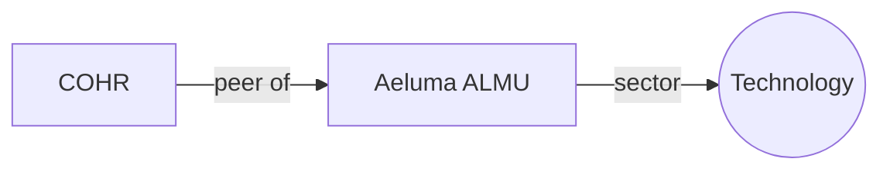

# Graph Writeup

## Overview

Generate deterministic Mermaid network diagrams from RDF-structured data and embed
them directly in the Thesis as fenced mermaid code blocks.  The frontend
renders these into interactive graph visualisations.

## Quick Use

1. Identify the relationship to visualise (peers, news sources, business model).
2. Call the appropriate graph tool to get the Mermaid block.
3. Paste the returned block verbatim into the `thesis` field at the right section.

## Graph Tools

### Peer relationship network
```
graph_peer_network(ticker)
```
Fetches FMP peers + stock context and produces a directed graph showing sector,
industry, country, and peer connections.

### News source network
```
graph_news_sources(ticker)
```
Maps the ticker to its news API sources with article counts on edges.

### Business model diagram
```
graph_business_model(ticker, extra_links_json)
```
Builds a top-down graph of company to sector/industry.  Pass ad-hoc triples
extracted from 10-K text as extra_links_json:
[["ALMU", "sells to", "Data Centers"], ["ALMU", "competes with", "II-VI"]]

## Writeup Insertion

Return the Mermaid block in the thesis field.  Example:



## Legacy SVG approach

The generate_chart tool (SVG file-based) is still available for custom time-series
charts when Mermaid xychart-beta is insufficient.

## Notes

- Limit peer networks to 10 nodes for readability.
- If a graph tool errors or returns no data, note it in chat only.
- Mermaid graph direction: "LR" (left-right) for wide diagrams, "TD" (top-down)
  for deep hierarchies.
